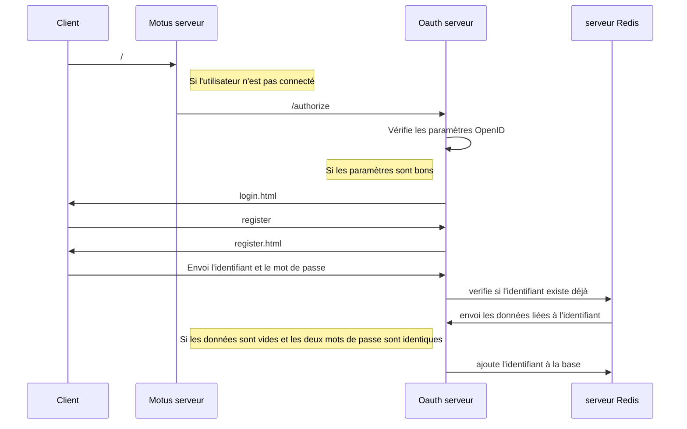
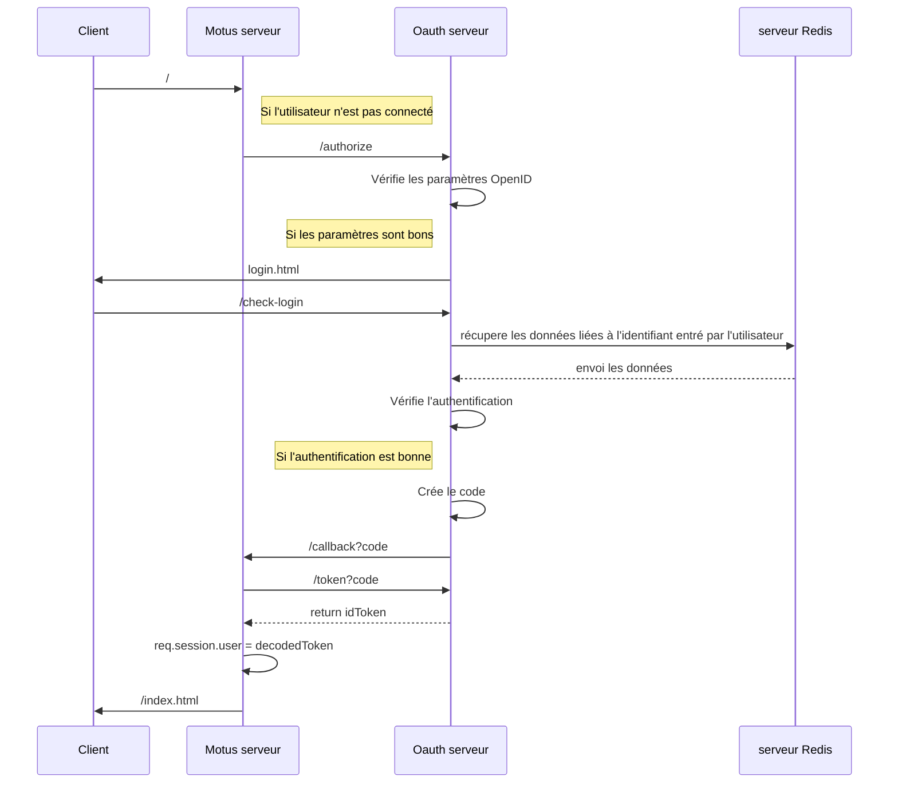
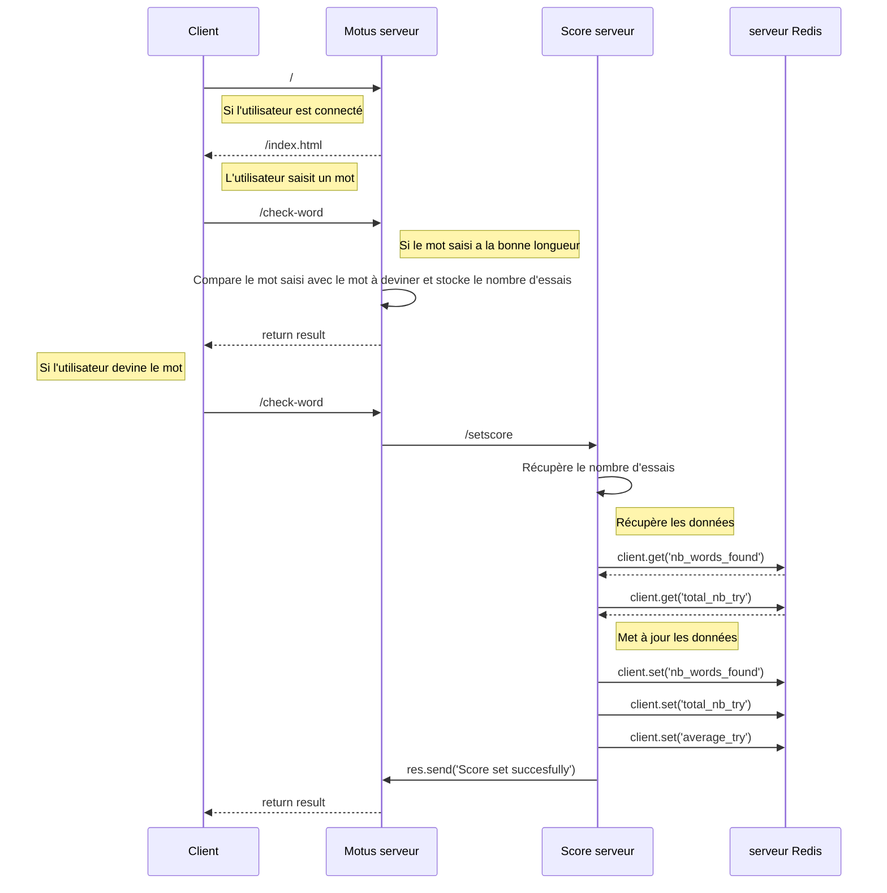

# Motus App

## Description 

Application permettant de jouer au motus. Jeu programmé en Javascript avec Node.js et Express.js.

## Regle du jeu

Le but du jeu est de trouver un mot dont le nombre de lettre est donné tout en utilisant le moins d'essais possible. Après chaque essais, les lettres bien placées s'affichent en vert, 
les lettres mal placées mais appartenant au mot recherché s'affichent en orange et les lettres qui n'appartiennent pas au mot s'affichent en rouge. Le mot à trouver change chaque jour.

## Lancement de l'application
 
Aller dans le dossier motus
 
 ```
cd motus
 ```

Lancer l'application

```
sudo chmod ugo+rwx  data/redis/dump.rdb
docker-compose up --build
```

Aller à http://localhost:3001

## Diagrammes de séquence

### Inscription


### Connexion


### Déroulement du jeu


## Axes d'améliorations


